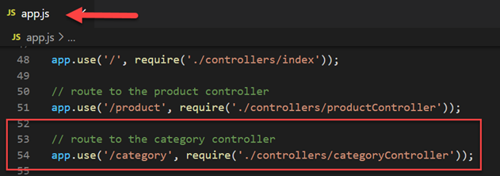

# Web API & Database: Part 2 - add features

Enda Lee 2022

### Quick Start

1. Download the start site from this repository
2. Open in VS Code
3. In a terminal run `npm install`
4. Start the application using `npm run dev`


## Introduction

In **[Part 1](https://github.com/elee-tudublin/2022.SSWD_4.1_Web-API_Database_Setup)** you set up a database and connected to an API. **Part 2** will build on that functionality, adding the following functions and features to support the client application in **Part 3** 

1. Validation of input parameters.
2. Get a single `product` by `id`.
3. Get all `categories`.
4. Get all `products` in a `category`.

As a reminder, the diagrams show the flow of data through the API and also the database design.

|  |  |
| --------------------------------- | ---------------------------------------------------- |


## Environment Variables

Before starting, it is important to copy the **`.env.example `** file to **`.env`**. This file contains the database URL which is required by Prisma


## Getting `categories` from the database

Retrieving `categories` from the database is a very similar process as getting `products`. We will respect the idea of keeping functionality in the correct layer.

### 1. Add a controller to handle `HTTP` `Requests` and `Responses`

The `categoryController` will contain `endpoints` to handle these requests. Add `categoryController.js` to the `Controllers folder`.


**`categoryController.js`** contains a single end-point which will return all categories.

```javascript
// This is the category controller

// Import router package
const router = require('express').Router();

// Import the category service
const categoryService = require("../services/categoryService.js");

// This endpoint will return all category data from the database
router.get('/', async(req, res) => {

    // Get result from the category service
    const result = await categoryService.getCategories()

    // Send a  response
    res.json(result);
});

// export
module.exports = router;
```

**Now add a route to `app.js` for this controller**




### 2. The category service

The `category controller` calls the service. 

Add **`categoryService.js`** to the `services` folder. 

```javascript
// Category service functions

// Import dependencies
// DataAccess
const categoryData = require('../dataAccess/categoryData.js');

// Function to get all categories
//
async function getCategories() {
    
    // call data access to get all categories
    const categories = await categoryData.getCategories();
  
    // return categories
    return categories;
  }
  
// Module exports
// expose these functions
module.exports = {
    getCategories
};
```


### 3. Getting category data

The `data access layer` will use `Prisma` to get categories from the database.

Add **`categoryData.js`** to the `dataAccess` folder.

```javascript
// Data access functions for categories

// Import dependencies
const { PrismaClient } = require('@prisma/client');

// declare an instance of the client
const prisma = new PrismaClient();

// Get all categories from DB
//
async function getCategories() {
    // define variable to store categories
    let categories;

    try {  
        // Get all categories
        // https://www.prisma.io/docs/reference/api-reference/prisma-client-reference#findmany
        categories = await prisma.category.findMany();

    // Catch and log errors to server side console 
    } catch (err) {
        console.log('DB Error - get all categories: ', err.message);
    } finally {

    }
    // return all categories found
    return categories;
}

// Export 
module.exports = {
    getCategories,
};

```


### 4. Test the application

Opening http://localhost:5000/category in a web browser should load the category data.


## Getting a `product` by `id`

Next the product `controller` `service` and `data access` will be modified so that a single product can be requested by `product id`.

### 1. The `product controller`

Open `productController.js` and add a new endpoint to handle the request. 

Requests will include the id in the form http://localhost:3000/product/3

This is a little different from previous examples where parameters where includes in  `req.query`. This time we will use `req.params`. The main difference is that `params` separated by  `/` instead o `?` and `&`.

Here is the new endpoint to be added after the existing one in **`productController.js`**

```javascript
// This endpoint will return a single product by id
// The endpoint is same as for / but with an added :id parameter
router.get('/:id', async(req, res) => {

    // Try to get data and return
    try {
        // Get result from the product service
        // passing the value from req.params.id
        const result = await productService.getProductById(req.params.id);

        // Send a  response
        res.json(result);

    // Handle server errors    
    } catch (err) {
        res.status(500);
        res.send(err.message);   
    }
});
```


### 2. The `product service`

The controller calls `productService.getProductById()` which will be implemented next.

##### Before we can get the data, the id parameter should be validated to ensure that it is a valid number.

To help with validation, install the `validator` package (https://www.npmjs.com/package/validator) which is a library of useful string `validation` and `sanitation` functions.

To install:

```bash
npm install validator
```

The product `id` is easy to validate - check for a positive integer value with no signs or special characters. As we will be re-using this validation, add it to a package which can be shared. Add a new folder named `validators` and inside the folder add `baseValidators.js`


**`baseValidators.js`** imports the validator library and defines the `validateId(num)` function.

```javascript
// Base Validation functions

// Validation lib
// for documentation see: https://www.npmjs.com/package/validator
const validator = require("validator");

// function to validate an id
// An id is a positive number with no sign (+,-, etc.)
// return Not a number or else cast as Number and return
//
function validateId(num) {
    if (validator.isNumeric(num + '', { no_symbols: true })) {
      return Number(num);
    }
    return false;
  }

// Module exports
// expose these functions
module.exports = {
    validateId
};
```

The function uses `validator.isNumeric` to verify that `num` is a numeric value matching our requirements for an `id`. The full validator reference is available at https://github.com/validatorjs/validator.js

##### Import `baseValidator.js` in `productService.js`


Then add a new function `getProductById(id)` to **`productService.js`**

```javascript
// Function to get product by id
//
async function getProductById(id) {
  // validate the id
  const validatedId = validate.validateId(id);

  if (validatedId) {
    // Call the data access function to get product with matching id
    const product = await productData.getProductById(validatedId);

    // return the product
    return product;
  } else {
    return "Invalid product id";
  }
}
```


### 3. Product data access

The `Prisma` query to get a product by id  uses its `findUnique` function with a `where` clause. Add the following function to **`productData.js`**

```javascript
// Get product by id from DB
//
async function getProductById(id) {

    // Define variable
    let product;

    try {
        // use where with findUnique
        product = await prisma.product.findUnique ({
            where: {id: Number(id)}
        });

    // Catch and log errors to server side console 
    } catch (err) {
        console.log('DB Error - get all products: ', err.message);
    } finally {

    }
    // return a single product if found
    return product;
}
```


### 4. Test the new functionality

Open http://localhost:5000/product/6 (change the id so that it works with your database). The result should be a single product.


## Exercises:

Following the example above, add the functionality required to retrieve products in a particular category .

1. Results should be returned for http://localhost:5000/product/bycat/:catId
2. Use a service function `getProductsByCatId(id) ` to validate and call data access for products.
3. Add a data access function named `getProductsByCatId(catId)` to query the database using Prisma.
   1. see https://www.prisma.io/docs/reference/api-reference/prisma-client-reference#where


## References

Prisma Tutorial - https://www.prisma.io/docs/getting-started/setup-prisma/add-to-existing-project/relational-databases-typescript-postgres

Prisma Schema Reference - https://www.prisma.io/docs/reference/api-reference/prisma-schema-reference

Prisma Queries - https://www.prisma.io/docs/reference/api-reference/prisma-client-reference#model-queries

Validator - https://github.com/validatorjs/validator.js


------

Enda Lee 2022
